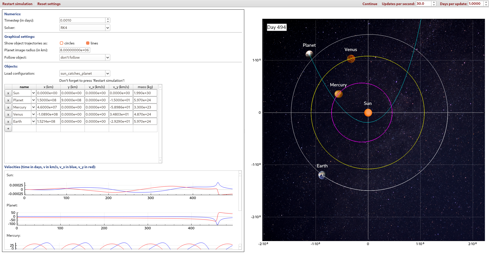

# Simulate a solar system

This program simulates a solar system that you can modify as you wish. It is developed in the [Rethfeld group](https://www.physik.uni-kl.de/rethfeld/) at RPTU, Kaiserslautern, Germany by Markus Uehlein and Tobias Held.  
It designed for an 1-1.5h workshop for students and used at ["Tag der Physik"](https://www.physik.uni-kl.de/aktuell/veranstaltungen/tag-der-physik).
As physical basics Newton's law of gravitation and Kepler's laws are helpful.  
The program itself and the GUI are written in english, everything else in german.

## Installation
### Requirements
The program is written in C++ and therefore requires [gcc](https://gcc.gnu.org/) and [Qt](https://www.qt.io/).  
It is testet with gcc version 8, 10 and 12.2.0 and Qt version 5.9, 5.9, 5.12. and 5.15.8.
Old Qt versions are available [here](https://download.qt.io/archive/qt/).

### Getting the requirements on "Windows"
The most successful way to install the requirements is to install the Linux subsystem for Windows:
* Open the powershell and run <code>wsl --install</code>. Restart your PC after installation.
* Install the [Debian app from the Windows store](https://apps.microsoft.com/detail/9msvkqc78pk6?hl=de-DE&gl=DE).
* Open the Debian app and generate a user. Run <code>sudo apt update</code> and <code>sudo apt upgrade</code>.
* Run <code>sudo apt install build-essential g++ qtbase5-dev qt5-qmake qtbase5-dev-tools</code>.

### Getting started
* clone repository and switch to the directory
* run <code>qmake</code>
* run <code>make</code>
* start program with <code>./bin/keplerplusplus</code>

### Object pictures
Due to copyright issues there is only a sun and a default planet image uploaded to github.
You can easily use more pictures if you add them to the icons directory. All <code>.png</code> files can be shown in the GUI.
Just name the object after the file. Underscores and numbers will be ignored. E.g.: An Object with name <code>Sun_2</code> will show the picture of <code>icons/Sun.png</code> if it exists.
If not, the default image is shown.

## Licence
* The program is subject to the GNU GENERAL PUBLIC LICENSE.
* All image files are licensed under creative common (links below).
* The program uses a modified version of [QCustomPlot](https://www.qcustomplot.com/), [QScienceSpinBox](https://www.matthiaspospiech.de/blog/2009/01/03/qt-spinbox-widget-with-scientific-notation/) and [Ubuntu.qss](https://github.com/GTRONICK/QSS/blob/master/Ubuntu.qss). 

### Image links
* https://commons.wikimedia.org/wiki/File:Bringer_of_War_Planet.png
* https://commons.wikimedia.org/wiki/File:Sun_in_February_%28transparent%29.png
* https://www.rawpixel.com/image/4026737/photo-image-background-aesthetic-star
* https://www.iconfinder.com/icons/186407/arrow_up_icon
* https://www.iconfinder.com/icons/186411/arrow_down_icon